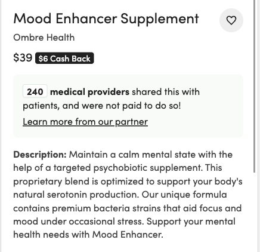
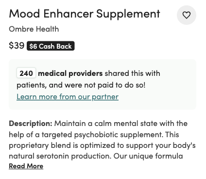
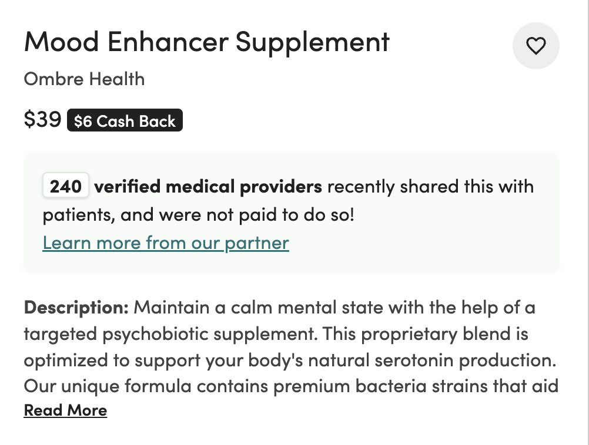
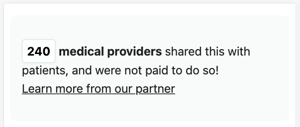
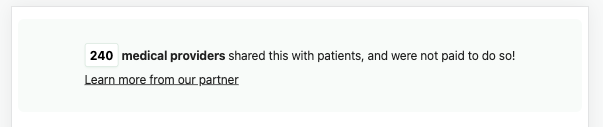
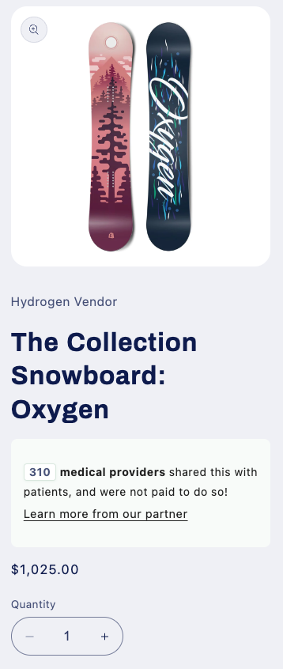

# brand-library

This project provides sample code for the Frontrow widget that can be included on brand partners' websites. This widget displays the number of provider pages a specific product has been added to.

See [this doc](https://docs.google.com/document/d/1hZhBG_1hGyUHoUMWNK-WXQBhqlTAjJpPaZHuGKhPCcU/edit?usp=sharing) to learn more about where the widget should be placed, how to get the provider counts for each product, and other non-technical details.

The sample-screenshots folder in this project shows the widget in the context of each major code solution (React, HTML/CSS, Shopify). They are also displayed at the bottom of this file.

The following frameworks have sample code provided:
- HTML & CSS
- ReactJS with CSS or tailwind
- Shopify
- Framer
- Wordpress (with elementor plugin)

## Mobile & desktop versions

All versions account for differences between the desktop and mobile experiences. There are slight styling and copy changes between the 2 versions so it's important to include all code for whichever version is being used.

*Feel free to make changes to the styling and/or copy for both mobile and desktop. The code provided tested well on user tests done by Frontrow's design team.

You may need to adjust the font size on mobile to make content fit on two lines.
- For HTML edit: `html/widget.css:67`
- For React edit: `react/widget.css:62`
- For Shopify edit: `shopify/frontrow-widget.liquid:90`
  - Shopify styles already set font-size to 14px on mobile (16px on desktop)

## Wix

Please reach out to get more guidance how to implement this widget on a wix site. Due to the nature of the builder tool in wix, putting direct html code snippets (like the one provided in this project) aren't well supported.

Temporary edit access can be provided to a Frontrow engineer to make the changes themselves if that is preferred by the client.

## React

The react directory has a sample component for how many providers have added a product to their Frontrow Health page. This component should be copied into the health brand's project.

There is a version using css and a version using tailwind css classes.

The css should be copied into the health brand's project into the correct location for styles.

No other action needs to be taken for the tailwind version assuming tailwind is correctly installed and imported into the project already.

## HTML

The html directory has a sample page showing the widget for how many providers have added a product to their Frontrow Health page. This code can be copied into an html webpage. The css for the page is in its own file in the same directory. Be sure to include those styles in the website/app.

## Shopify

A screen recording of a sample store is provided [here](https://drive.google.com/file/d/1BhIiP2j2PWJWd7DxZWMQXHsrAtLA3U8X/view?usp=sharing) and in the Google Doc linked at the top of this document.

In order to add the custom widget to a shopify store, follow these steps:

#### Add metafield definition
1. Login to the Shopify admin portal.
2. Select "Settings" from the navigation on the left side of the page.
3. In the new pop up window, scroll down on the left side navigation and select "Custom Data".
4. Select "Products".
5. In the top right hand corner, click, "Add definition".
6. In the screen recording I already have a definition called frontrow-provider-count. Create a new metafield definition, called frontrow-provider-count and add the type integer. A description, minimum value, and maximum value are not required.
7. Click "Save".
8. Exit out of the settings modal.

#### Add code snippet to product details page
9. Navigate to the "Online Store" section in the left hand navigation.
10. On the themes page, select the three dots icon and go to "Edit Code".
11. In the left hand navigation, find the section called snippets and click "Add a new snippet"
12. Name the file `frontrow-widget.liquid`, enter just `frontrow-widget` in the file name input box.
13. Copy and paste the code from `./shopify/frontrow-widget.liquid` from this project into  your new file in Shopify. Save.
14. Go back to the file directory on the left hand side of the page and search for `product.liquid`. You are looking for the main product page for your Shopify site. This file could be named `main–product.liquid`, `product.liquid`, or `product-template.liquid`.
15. Scroll down until you find the section above where you want the frontrow widget to be. For example, in the screen recording I found the 'title' section. Just below the section (likely ending in `
`)
16. Add this code snippet: ``. This will include the widget in all product details pages where there is a value for the metafield we added at the beginning. Save the file.
17. Navigate out of the code editor back to the main page for your Shopify site.

#### Add provider count metafield values for targeted products
18. Navigate to the "Products" section in the left hand navigation.
19. Select the product you want to add a provider count for.
20. Scroll to the bottom of the page. Add the value in the new metafield input. Save the product.
21. Repeat this process for any other products you have the provider count for.

#### Preview widget on the store
21. Navigate to "Online Store" again. Next to the theme, click "Customize".
22. Click on a product you added a provider value for.
23. You should see the widget displayed under the product title (or wherever you chose to add the widget).
24. You can also verify that the widget doesn't show up on product pages that don't have a provider count.
25. Toggle between mobile and desktop views in the top right hand corner.

*The Shopify theme's colors, font sizes, etc. will take over and may overwrite some of the styles seen in the sample screenshots but should match the rest of your site. Feel free to change any styles at this point or leave them as is.

## Framer

1. Add the provided copy to your site where you want the widget to be.
2. In the side panel:
    - Make the number and "medical providers" copy bold
    - Make the number a different color, a non-black brand color is perfect
3. Create an override for the text section by selecting Code Override in the side panel
4. Create a new file called frontrow and paste the contents of `framer/frontrow.tsx` into the new file, making sure to delete the default code that was created upon creating the file
5. Back in the editor, select the new file and the function `someCssOverride`
    - This override file will add the tile behind the text. Feel free to change the `background` property in that file to match your brand colors
6. Save a preview by publishing a preview or pressing the "play" button in the top right hand corner
7. Repeat these steps and reuse the override file & function if you have the widget on any other pages

## Wordpress (with elementor)

1. In the elementor editor, click to add a new section where you want the snippet to be.
2. Search for html in the elements panel
3. Select the html type
4. Copy the code from `wordpress/widget.html` in the code section
5. In the next tab, Advanced, scroll to the bottom and select "Custom CSS"
6. Copy the code from `wordpress/widget.css` in the code section
7. You should see the widget as intended. Feel free to change colors to match your own branding at this point.
    - You can also drag and drop the widget to another spot on the page if you need.

## Testing

The component can be modified and tested in an online code editor like codedamn. Below are 2 playgrounds for the sample code provided in this repo.

- React playground: https://codedamn.com/playground/Wjw9IFI7NI1lPnkCBhbpd
- HTML playground: https://codedamn.com/playground/u9_00kMdzkBeex7bJqXX3

## Screenshots

### React & css
#### Mobile

#### Desktop

### React & tailwind
#### Mobile

#### Desktop

### HTML & css
#### Mobile

#### Desktop

### Shopify
#### Mobile

#### Desktop

